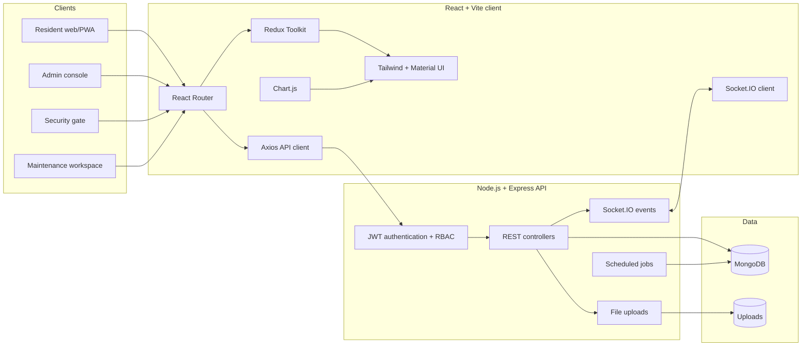

# Havenly Smart Community — Project Architecture

## System overview

## Frontend layers

| Layer | Responsibility |
|---|---|
| Pages | Role-specific screens for residents, admins, guards, and maintenance staff |
| Components | Shared shell, navigation, cards, status badges, dialogs, tables, and feedback |
| Redux | Authentication session and global UI state |
| Services | Axios client, JWT header injection, refresh-token retry |
| Hooks | API loading with a safe presentation/demo fallback |
| Data | Demo fixtures used only when the API is unavailable |

## Role routing

| Backend role | Product workspace |
|---|---|
| `Resident` | Visitors, complaints, payments, bookings, notices, vehicles, forum, profile |
| `Guard` | Gate verification, visitor check-in/out, vehicle lookup, emergency command |
| `Staff` | Assigned complaints, progress updates, completion workflow |
| `Admin` / `SuperAdmin` | Analytics, residents and units, complaints, visitors, facilities, revenue, notices, reports |

## API integration

The client consumes the existing `/api/v1` API. Vite proxies `/api`, `/uploads`, and `/socket.io` to the Express server at port `5000` during development.

Authentication uses access and refresh tokens. The Axios interceptor attaches access tokens and retries one failed request after a successful refresh. Demo sessions never send their placeholder token to the server.

## Important implementation boundaries

- Payment is recorded through the existing invoice payment endpoint; a production payment gateway still needs provider-side integration.
- The AI assistant UI, delivery-specific logs, and translations require new backend contracts before production activation.
- PDF receipt/report export is available client-side. Server-signed receipts can replace it later.
- PWA metadata and a service worker can be added as a deployment hardening phase.

## Local development

1. Copy `.env.example` to `.env` and configure MongoDB/JWT values.
2. Run the API with `npm run dev`.
3. In `client`, copy `.env.example` to `.env`.
4. Run the client with `npm run dev:client` from the repository root.
5. Open `http://localhost:3000`.

When the API is offline, the login screen can open any of the four demo workspaces so the complete UI remains presentable.
